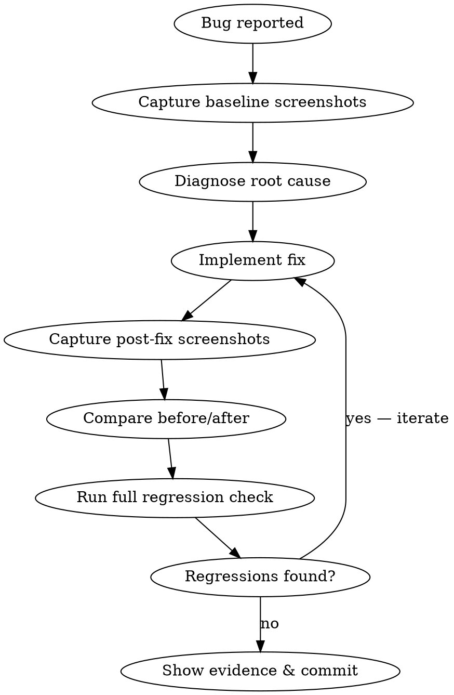

# Visual Bug Fixing

## Overview

**Fix visual bugs with screenshot evidence, not guesswork.** Capture before-state, diagnose root cause, fix, capture after-state, verify no regressions across all view modes. Never commit a visual fix without photographic proof it works and doesn't break anything else.

## When to Use

- User reports a visual bug (overlap, misalignment, wrong size, missing element, rendering artifact)
- You notice a visual inconsistency during other work
- A UI change causes unexpected layout shifts
- Screenshot diff failures in `ui_audit.py`

**When NOT to use:**
- Pure logic bugs with no visual impact — use superpowers:systematic-debugging
- Adding new UI features — use ui-consistency-audit + frontend-designer
- Updating test coverage — use viewer-ui-checklist

## Workflow



### Step 1: Capture Baseline Screenshots

Before touching any code, capture the current broken state. Use the Playwright MCP tools:

1. **Navigate** to the affected view using `browser_navigate` to the arrayview URL
2. **Set up the bug conditions** — press keys to enter the right mode, load the right array
3. **Screenshot the broken state** with `browser_take_screenshot` — save as `baseline_bug.png`
4. **Screenshot ALL other modes** that could be affected:
   - Normal view (default)
   - Immersive mode (`Shift+K`)
   - Compare mode (navigate to compare URL)
   - Diff modes (`Shift+X` to cycle)
   - Multiview (`v`)
   - Zen mode (`Shift+F`)
   - Zoomed state (`+` keys)

**Key selectors to inspect** (via `browser_snapshot` or `browser_evaluate`):
- `#canvas-wrap` — main canvas container
- `#slim-cb-wrap` — colorbar wrapper
- `#info` — info bar
- `.mode-egg` — mode indicator badges
- `#miniview` — minimap overlay
- `#dimbar` — dimension navigation bar

### Step 2: Diagnose Root Cause

Read the relevant source files. The UI lives in:

| Layer | File |
|-------|------|
| HTML structure | `arrayview/_viewer.html` |
| Inline CSS | `<style>` blocks in `_viewer.html` |
| Canvas rendering | JavaScript in `_viewer.html` (search for `scaleCanvas`, `mvScaleAllCanvases`, `compareScaleCanvases`) |
| Python server | `arrayview/_app.py` |
| Colorbar logic | `ColorBar` class in `_viewer.html` |

**Diagnosis checklist:**
- Is this a CSS issue (positioning, overflow, z-index, flexbox)?
- Is this a JS layout calculation issue (wrong width/height, missing mode branch)?
- Does the bug only appear in certain modes? Which scale function is involved?
- Does zoom level matter? Check the zoom-related code paths.
- Is this a race condition (element rendered before data arrives)?
- Is this an animation bug (stutter, jump, drift, timing, race)? → See `../.mex/patterns/animation-verify.md` (the standard screenshot workflow is NOT sufficient for animation)

**Check hard rules:** Before implementing a fix, check if the bug is a violation of a hard UI rule (R1-R35 in `ui-consistency-audit` Section 5b). If so, the fix should restore the invariant rather than work around it. Enable `?debug_ui=1` to see runtime invariant warnings in the browser console — they may pinpoint the exact rule being violated.

**Use `browser_evaluate` to inspect live DOM state:**
```javascript
// Get bounding boxes of key elements
JSON.stringify({
  canvas: document.querySelector('#canvas-wrap')?.getBoundingClientRect(),
  colorbar: document.querySelector('#slim-cb-wrap')?.getBoundingClientRect(),
  info: document.querySelector('#info')?.getBoundingClientRect(),
  viewport: { width: window.innerWidth, height: window.innerHeight }
})
```

### Step 3: Implement the Fix

Apply the minimal fix. Reference the ui-consistency-audit design rules (R1-R35) to ensure the fix doesn't violate any existing constraints.

**Common fix patterns:**
- **Overlap bugs**: Check z-index hierarchy, adjust `position`/`top`/`left`/`right`
- **Sizing bugs**: Trace the calculation chain in the relevant scale function
- **Mode-specific bugs**: Ensure all mode branches handle the element (check `isCompare`, `isMultiview`, `isImmersive`, `isZen` flags)
- **Zoom bugs**: Check `zoomLevel` interactions with element positioning

### Step 4: Capture Post-Fix Screenshots

Repeat the exact same navigation and key presses from Step 1. Screenshot every view that was captured in the baseline.

### Step 5: Compare Before/After

Present the before and after screenshots to the user. Explain:
- What was broken (with baseline screenshot)
- What changed in the code
- What it looks like now (with post-fix screenshot)

### Step 6: Full Regression Check

Run the automated visual audit:

```bash
uv run python tests/ui_audit.py --tier 1
```

This checks 14 core scenarios with DOM assertions and pixel diffs. If any fail:
- Read the failure output to identify which scenario regressed
- Screenshot that specific scenario manually to understand the regression
- Go back to Step 3 and iterate

For thorough validation (before committing):
```bash
uv run python tests/ui_audit.py --tier 2
```

**Only commit when Tier 1 passes clean.** Tier 2 failures should be investigated but may be pre-existing.

## Red Flags — STOP and Investigate

| Symptom | Likely Cause |
|---------|-------------|
| Fix works in normal mode but breaks compare | Missing branch in `compareScaleCanvases` |
| Element disappears on zoom | Absolute positioning without zoom-aware offsets |
| Fix works at 1440x900 but breaks at other sizes | Hardcoded pixel values instead of relative/calc |
| Colorbar overlaps canvas after fix | Forgot to account for colorbar width in canvas sizing |
| Mode eggs shift position | Changed a parent container's layout without updating egg anchoring |

## Common Mistakes

- **Fixing the symptom, not the cause** — A `display:none` hack hides the bug. Find why the element is in the wrong place.
- **Testing only the affected mode** — Visual bugs often have cross-mode impact. Always check at minimum: normal, immersive, compare, multiview.
- **Skipping the baseline screenshot** — Without before/after evidence, you can't prove the fix worked or detect subtle regressions.
- **Committing without running ui_audit.py** — DOM assertions catch things screenshots miss (off-by-1px overlaps, viewport overflow).
