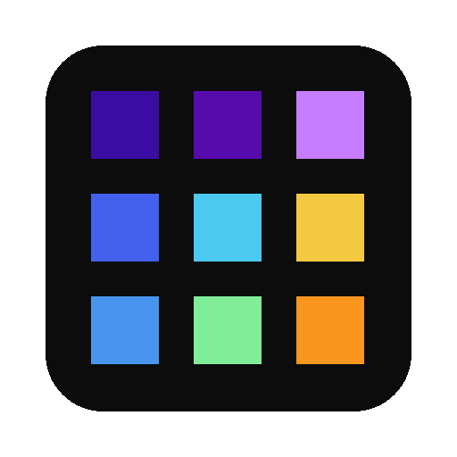

#  arrayview

This is my array viewer. There are many like it, but this one is mine.

Load up `.npy`, `.nii`, `.h5`, `.mat` and friends. 

Call from the terminal, Python/Julia/Matlab or Jupyter notebooks.

Opens in either a native window, browser tab, inline cell,
or VS Code panel. 

Follows you to SSH remotes and tunnels.

You can even click an array in the VS Code explorer to open up the viewer.

Check the [docs](https://oscarvanderheide.github.io/arrayview/) to learn more. 

For now, just try it out with

```bash
uvx arrayview your_array.npy
```
Click around, press some keys, there's more to it than meets the eye.

